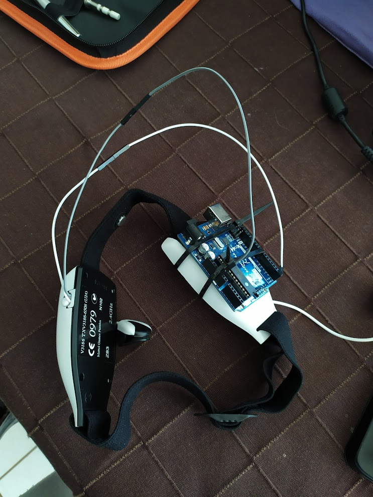

# Processing Brain Grapher

Le Processing Brain Grapher est une application de visualisation en temps réel des données EEG (électroencéphalographie) provenant d'un casque Mattel MindFlex. Il permet d'afficher les signaux EEG bruts, ainsi que les valeurs d'attention et de méditation calculées par le casque.

## Configuration matérielle

Le casque Mattel MindFlex est connecté à une carte Arduino Uno via une liaison série. Les fils du casque sont reliés aux broches appropriées de l'Arduino pour permettre la communication des données EEG.

## Prérequis logiciels

- Processing 3.x
- Bibliothèque ControlP5 pour Processing
- Arduino IDE

## Installation

1. Clonez ce dépôt GitHub ou téléchargez les fichiers du projet.

2. Installez Processing 3.x à partir du site officiel : [https://processing.org/download/](https://processing.org/download/)

3. Installez la bibliothèque ControlP5 pour Processing. Vous pouvez l'installer via le gestionnaire de bibliothèques intégré à Processing en allant dans `Sketch` > `Importer une bibliothèque` > `Ajouter une bibliothèque`, puis en recherchant "ControlP5".

4. Installez l'Arduino IDE à partir du site officiel : [https://www.arduino.cc/en/software](https://www.arduino.cc/en/software)

5. Connectez votre carte Arduino à votre ordinateur via un câble USB.

## Configuration

1. Ouvrez le fichier `BrainSerial.ino` dans l'Arduino IDE.

2. Compilez et téléversez le code sur votre carte Arduino.

3. Ouvrez le fichier `BrainGrapher.pde` dans Processing.

4. Dans la fonction `setup()`, trouvez la ligne `serial = new Serial(this, Serial.list()[1], 9600);` et remplacez `[1]` par l'index correspondant au port série de votre Arduino. Les ports série disponibles sont affichés dans la console Processing au démarrage.

5. Exécutez le sketch Processing.

## Utilisation

- Le graphique principal affiche les signaux EEG bruts en temps réel.
- Les barres latérales affichent les valeurs d'attention et de méditation calculées par le casque Mattel MindFlex.
- Le voyant en haut à droite indique la qualité de la connexion avec le casque.
- Utilisez les contrôles en haut à gauche pour ajuster les paramètres d'affichage du graphique, tels que l'échelle, le mode de rendu et le nombre de pixels par seconde.

## Structure du projet

- `BrainGrapher.pde` : Fichier principal de l'application Processing. Il gère la configuration, la communication série, la mise à jour et l'affichage des données.
- `BrainSerial.ino` : Code Arduino pour lire les données du casque Mattel MindFlex et les envoyer via le port série.
- `Channel.pde` : Classe représentant un canal EEG, stockant les données et les informations associées.
- `ConnectionLight.pde` : Classe gérant l'affichage du voyant de qualité de connexion.
- `Graph.pde` : Classe responsable du rendu du graphique principal des signaux EEG.
- `Monitor.pde` : Classe gérant l'affichage des barres latérales pour les valeurs d'attention et de méditation.
- `Point.pde` : Classe représentant un point de données EEG avec un horodatage et une valeur.

## Améliorations suggérées

1. Ajouter une option pour sauvegarder les données EEG dans un fichier pour une analyse ultérieure.
2. Implémenter une fonctionnalité permettant de charger des données EEG préenregistrées à partir d'un fichier.
3. Ajouter des options de personnalisation supplémentaires pour les graphiques (couleurs, styles de ligne, polices, etc.).
4. Implémenter des fonctionnalités d'analyse de données plus avancées (moyenne, variance, FFT, etc.).
5. Ajouter une option pour exporter les graphiques ou les données sous forme d'images ou de fichiers PDF.
6. Créer un système de gestion des erreurs plus robuste pour gérer les exceptions et les situations d'erreur.
7. Optimiser les performances du programme en limitant le nombre de points de données affichés à l'écran.
8. Ajouter une fonctionnalité de "marqueurs d'événements" permettant à l'utilisateur de marquer des points spécifiques dans le temps pendant l'enregistrement.
9. Intégrer des algorithmes de traitement du signal plus avancés (filtrage passe-bande, rejet des artefacts, séparation de sources, etc.).
10. Créer une documentation utilisateur complète expliquant comment installer, configurer et utiliser le programme.

## Contribuer

Les contributions à ce projet sont les bienvenues ! Si vous souhaitez proposer des améliorations, corriger des bogues ou ajouter de nouvelles fonctionnalités, n'hésitez pas à ouvrir une issue ou à soumettre une pull request sur le dépôt GitHub.

## Licence

Ce projet est sous licence MIT. Voir le fichier [LICENSE](LICENSE) pour plus de détails.

## Remerciements

- Bibliothèque ControlP5 pour Processing : [https://github.com/sojamo/controlp5](https://github.com/sojamo/controlp5)
- Bibliothèque Arduino Brain Library : [https://github.com/kitschpatrol/Arduino-Brain-Library](https://github.com/kitschpatrol/Arduino-Brain-Library)
- Casque Mattel MindFlex : [https://www.mattelgames.com/en-us/kids/mindflex-games](https://www.mattelgames.com/en-us/kids/mindflex-games)
